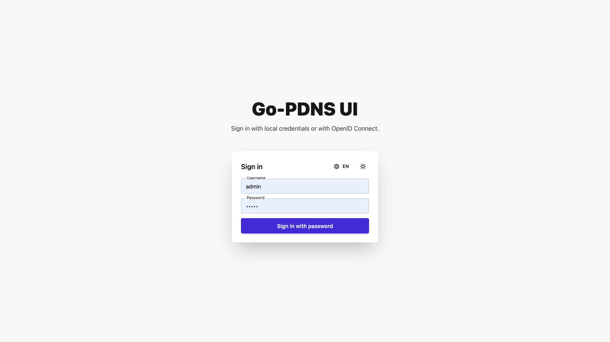
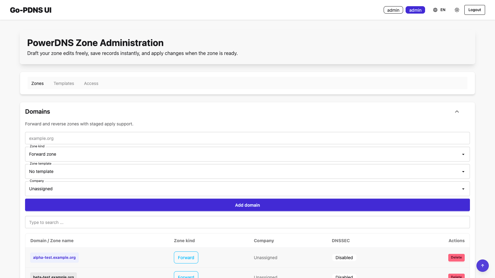
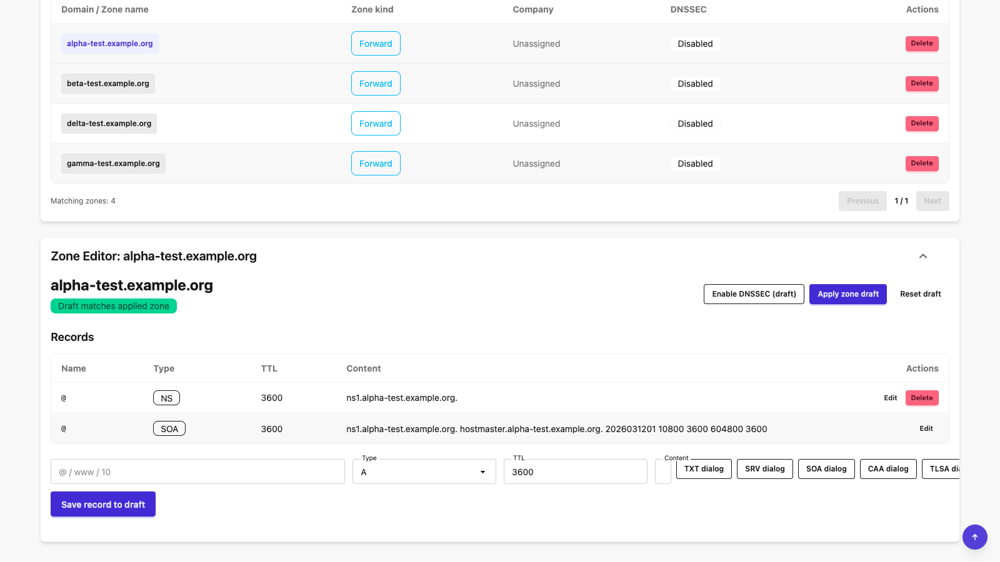
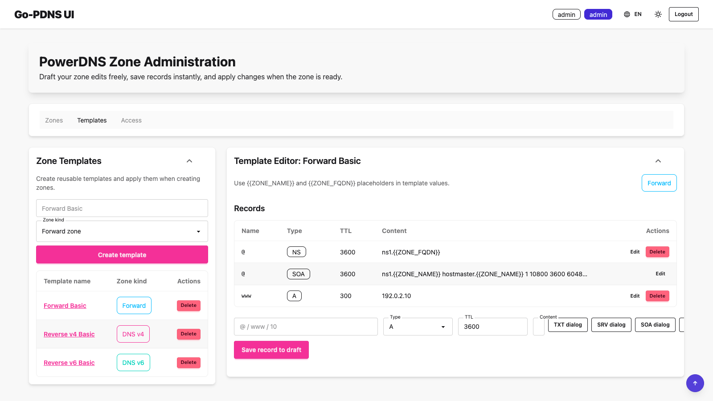
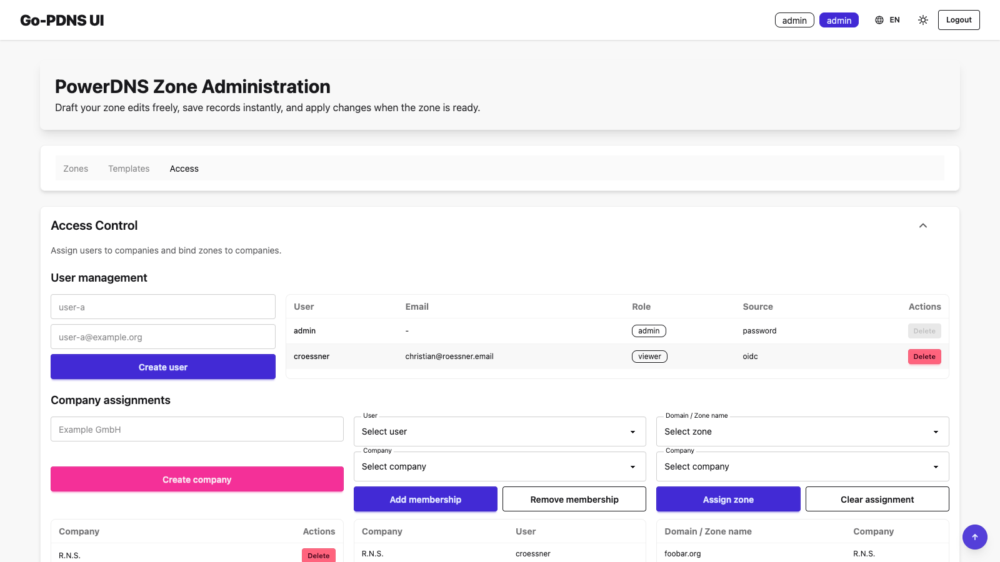

# Go-PDNS UI

Modern HTMX UI for administering PowerDNS zones with draft/apply workflow.

## Features

- Login via hardcoded username/password (`admin`/`admin`)
- Optional OpenID Connect login (Discovery + Authorization Code + PKCE)
- Role mapping from OIDC `groups` claim (`admin` / `user` / `audit`, fallback `viewer`)
- Domain list with create/delete
- Zone editor with record add/delete
- Company-based access control with persistent SQL storage
- DNSSEC toggle on draft state
- Draft vs apply behavior per zone
- Structured helper dialogs for TXT, SRV, SOA, CAA and TLSA records
- Reverse zone validation for IPv4 (`.in-addr.arpa`) and IPv6 (`.ip6.arpa`)
- PowerDNS API abstraction with real backend integration
- Dark mode toggle
- Multi-language UI (`de`, `en`) via JSON locale files

## Screenshots

### Login



### Zones overview



### Zone editor



### Templates



### Access control



## Configuration

### Server

- `GO_PDNS_UI_LISTEN_ADDRESS` (default: `:8080`)
- `GO_PDNS_UI_LOG_LEVEL` (default: `INFO`; allowed: `DEBUG`, `INFO`, `WARN`, `ERROR`)
- `GO_PDNS_UI_AUTH_OIDC_ONLY` (default: `false`; if `true`, local password login is disabled)
- `GO_PDNS_UI_AVAILABLE_RECORD_TYPES` (optional; comma/space-separated RR types shown in editor type selectors and helper buttons)

### Security

- `GO_PDNS_UI_FORCE_INSECURE_HTTP` (default: `false`; forces the app to treat all requests as HTTP, disabling `Secure` cookie flags and suppressing `Strict-Transport-Security`)
- `GO_PDNS_UI_TRUSTED_PROXIES` (optional; comma/space-separated list of CIDR ranges whose `X-Forwarded-Proto` and `X-Forwarded-Host` headers are trusted — required when running behind a reverse proxy)
- `GO_PDNS_UI_SESSION_INACTIVITY_TIMEOUT_MINUTES` (default: `120`; sessions idle longer than this are automatically revoked)

**Trusted proxies** must be configured when the app runs behind a reverse proxy that sets `X-Forwarded-Proto`. Without this setting the app ignores forwarded headers entirely, which means:

- `Strict-Transport-Security` is not sent (HTTPS not detected)
- Session and CSRF cookies are not marked `Secure`
- OIDC post-logout redirect URL is built with `http://` instead of `https://`

For a direct Docker Compose deployment behind Caddy, set `GO_PDNS_UI_TRUSTED_PROXIES=172.16.0.0/12` (Docker Compose default subnet range). Use the narrowest range that covers your actual proxy IP(s) in production.

All responses include the following security headers regardless of proxy configuration:

- `Content-Security-Policy` with a per-request nonce for inline scripts (`'unsafe-inline'` is not used for scripts)
- `X-Content-Type-Options: nosniff`
- `X-Frame-Options: DENY`
- `Referrer-Policy: strict-origin-when-cross-origin`
- `Permissions-Policy: geolocation=(), microphone=(), camera=()`
- `Strict-Transport-Security` (only when HTTPS is detected via TLS or a trusted proxy)

**Rate limiting** for password login: after 5 failed attempts from the same IP, that IP is locked out for 60 seconds. The lockout key is always the direct peer IP (`RemoteAddr`) — it cannot be bypassed via `X-Forwarded-For`.

### Access Control / Persistence

- `GO_PDNS_UI_AUTHZ_MODE` (default: `off`; values: `off`, `company`)
- `GO_PDNS_UI_DATABASE_URL` (required for `GO_PDNS_UI_AUTHZ_MODE=company`; PostgreSQL DSN)
- `GO_PDNS_UI_DB_MAX_OPEN_CONNS` (default: `10`)
- `GO_PDNS_UI_DB_MAX_IDLE_CONNS` (default: `5`)
- `GO_PDNS_UI_DB_CONN_MAX_LIFETIME_SECONDS` (default: `300`)
- `GO_PDNS_UI_AUDIT_RETENTION_DAYS` (default: `180`; audit entries older than this are deleted automatically)
- `GO_PDNS_UI_AUTHZ_OIDC_AUTO_CREATE` (default: `true`; when `false`, only pre-created OIDC users can sign in)

Behavior in `company` mode:

- Admins can create companies, assign users to companies, and assign zones to companies.
- Users can view/edit zones assigned to one of their companies.
- Viewers can only view assigned zones (no DNS edits/apply/reset actions).
- Access control data is persisted in PostgreSQL.
- User/subject principals are auto-synced on authenticated requests.
- Admins can pre-create OIDC principals (without local passwords) in Access Control.
- If `GO_PDNS_UI_AUTHZ_OIDC_AUTO_CREATE=false`, unknown OIDC users are rejected at login.
- Audit log retention cleanup runs against the same PostgreSQL DSN when `GO_PDNS_UI_DATABASE_URL` is configured.

Important role note:

- Local password login currently authenticates as role `admin`.
- Role `user` is typically reached through OIDC group mapping (`GO_PDNS_UI_OIDC_USER_GROUP`).
- Role `audit` is typically reached through OIDC group mapping (`GO_PDNS_UI_OIDC_AUDIT_GROUP`) and gets Audit Log access only.
- If OIDC groups do not match `admin`/`user`/`audit`, role falls back to `viewer`.

Bootstrap checklist for `company` mode:

1. Start the app with `GO_PDNS_UI_AUTHZ_MODE=company` and a valid `GO_PDNS_UI_DATABASE_URL`.
2. Create OIDC principals in Access Control (or let users sign in once to auto-create entries).
   If `GO_PDNS_UI_AUTHZ_OIDC_AUTO_CREATE=false`, pre-creating principals is required.
3. As admin, create one or more companies in the Access Control panel.
4. Assign principals to companies.
5. Assign zones to companies.
6. Verify with a non-admin user that only assigned zones are visible.

Logging:

- Structured `slog` text output in `key=value` format.
- Startup, HTTP requests, auth events, OIDC introspection, DNS/template operations and backend errors are logged.
- Use `GO_PDNS_UI_LOG_LEVEL=DEBUG` for troubleshooting.

### Local login

- `GO_PDNS_UI_USERNAME` (default: `admin`)
- `GO_PDNS_UI_PASSWORD` (default: `admin`)
- Password login is unavailable when `GO_PDNS_UI_AUTH_OIDC_ONLY=true`.
- If neither variable is set, the app logs an `ERROR`-level warning at startup. Always set explicit credentials before exposing the app to any network.

### OIDC (optional)

- `GO_PDNS_UI_OIDC_DISCOVERY_URL` (required; must be the full discovery endpoint `.../.well-known/openid-configuration`)
- `GO_PDNS_UI_OIDC_ISSUER_URL` (optional override for issuer validation when discovery URL differs)
- `GO_PDNS_UI_OIDC_INTROSPECTION_URL` (optional override for OAuth2 token introspection endpoint; when empty, `introspection_endpoint` from discovery is used)
- `GO_PDNS_UI_OIDC_INTROSPECTION_AUTH_METHOD` (default: `client_secret_basic`; allowed: `client_secret_basic`, `client_secret_post`)
- `GO_PDNS_UI_OIDC_INSECURE_SKIP_VERIFY` (optional, default `false`; only for local/dev with self-signed certs)
- `GO_PDNS_UI_OIDC_CLIENT_ID`
- `GO_PDNS_UI_OIDC_CLIENT_SECRET` (required for introspection auth)
- `GO_PDNS_UI_OIDC_REDIRECT_URL` (for example `http://localhost:8080/auth/oidc/callback`)
- `GO_PDNS_UI_OIDC_SCOPES` (default: `openid profile email groups`)
- `GO_PDNS_UI_OIDC_ADMIN_GROUP` (default: `admin`)
- `GO_PDNS_UI_OIDC_USER_GROUP` (default: `user`)
- `GO_PDNS_UI_OIDC_AUDIT_GROUP` (default: `audit`)

OIDC login flow in this app:

1. Authorization Code + PKCE login is completed.
2. The returned `access_token` is sent to the introspection endpoint (env override or discovery metadata).
3. Login is accepted only when introspection returns `active=true`.
4. If the introspection response contains `client_id`, it must match `GO_PDNS_UI_OIDC_CLIENT_ID`.
5. After successful introspection, the ID token is verified and groups are mapped to `admin`/`user`; unmatched groups fall back to `viewer`.

Important discovery URL behavior:

- The app does **not** append `/.well-known/openid-configuration` automatically.
- `GO_PDNS_UI_OIDC_DISCOVERY_URL` must already contain that exact suffix.
- If discovery contains `end_session_endpoint`, `/logout` redirects the browser there after local session revoke.

### PowerDNS API

- `GO_PDNS_API_URL` (for example `http://127.0.0.1:8081/api/v1`)
- `GO_PDNS_API_KEY`
- `GO_PDNS_SERVER_ID` (default: `localhost`)
- `GO_PDNS_HTTP_TIMEOUT_SECONDS` (default: `10`)

## Setup

Create your local env file:

```bash
cp .env.example .env
```

Adjust the values in `.env` for your environment.

Notes:

- If OIDC variables are unset, local username/password login stays active.
- With `GO_PDNS_UI_AUTH_OIDC_ONLY=true`, OIDC configuration is mandatory.
- If OIDC is enabled, introspection must be available (via `GO_PDNS_UI_OIDC_INTROSPECTION_URL` or discovery metadata); inactive tokens are rejected.
- If your IdP listens only on IPv4, prefer `127.0.0.1` over `localhost` in OIDC URLs.
- If `GO_PDNS_API_URL` and `GO_PDNS_API_KEY` are unset, the app uses in-memory demo data.
- In `company` mode, non-admin users without company+zone assignment will see an empty zone list.

Example OIDC setup:

```bash
GO_PDNS_UI_OIDC_DISCOVERY_URL=https://idp.example.com/realms/demo/.well-known/openid-configuration
GO_PDNS_UI_OIDC_INTROSPECTION_URL=https://idp.example.com/realms/demo/protocol/openid-connect/token/introspect
GO_PDNS_UI_OIDC_INTROSPECTION_AUTH_METHOD=client_secret_basic
GO_PDNS_UI_OIDC_CLIENT_ID=go-pdns-ui
GO_PDNS_UI_OIDC_CLIENT_SECRET=change-me
GO_PDNS_UI_OIDC_REDIRECT_URL=http://localhost:8080/auth/oidc/callback
```

## Run

```bash
set -a && source .env && set +a
go run ./cmd/go-pdns-ui
```

The UI is available at `http://localhost:8080`.

Print version/build metadata:

```bash
./bin/go-pdns-ui --version
```

## Make Targets

```bash
make run
make test
make build
make docker-build
make docker-run
make compose-up
make compose-down
make compose-logs
make generate-config   # fill nauthilus.yml from template using .env (required for remote)
make sbom
```

## Docker

Build:

```bash
docker build -t go-pdns-ui:local .
```

Run with env file:

```bash
docker run --rm -p 8080:8080 --env-file .env go-pdns-ui:local
```

## SBOM

Generate SBOMs for source and Docker image:

```bash
make sbom
```

Output files are written to `sbom/` as pretty-printed SPDX JSON:

- `go-pdns-ui-source.spdx.json`
- `go-pdns-ui-image.spdx.json`

Customize via Make variables, for example:

```bash
make sbom SBOM_DOCKER_IMAGE=go-pdns-ui:local SBOM_DOCKER_PULL=false
```

## Docker Compose (Full Stack)

The repository includes a full stack in `docker-compose.yml`:

- `app` (go-pdns-ui)
- `pdns` (PowerDNS Authoritative API)
- `db` (PostgreSQL for PowerDNS + go-pdns-ui access-control persistence)
- `nauthilus` (`ghcr.io/croessner/nauthilus:v2.0.13`, OIDC IdP demo setup)
- `proxy` (single Caddy TLS reverse proxy for `app` + `nauthilus`)
- `valkey` (Redis-compatible store for Nauthilus sessions/tokens)

### Local development

No configuration required. Start directly:

```bash
docker compose up -d --build
```

Open:

- UI: `https://ui.127.0.0.1.nip.io:8090`
- PowerDNS API endpoint: `http://localhost:8081/api/v1`
- Nauthilus OIDC discovery: `https://127.0.0.1.nip.io:8090/.well-known/openid-configuration`

The nip.io domains resolve to `127.0.0.1` without any DNS setup. Caddy issues a self-signed CA certificate automatically (`tls internal`).

Demo logins:

- OIDC-only login via Nauthilus:
  - `admin` / `admin` (OIDC group `admin` → app role `admin`)
  - `user` / `user` (OIDC group `user` → app role `user`)

Notes for the integrated OIDC demo:

- `app` is preconfigured with discovery/client/redirect values for the bundled Nauthilus service via the shared Caddy proxy.
- Introspection endpoint and logout endpoint are discovered automatically from OIDC discovery metadata.
- Nauthilus test users and role attributes are defined in `deploy/nauthilus/logins.csv`.
- Nauthilus configuration is located at `deploy/nauthilus/nauthilus.yml`.

### Remote deployment

Copy and edit the environment file:

```bash
cp .env.example .env
```

Key variables to change (see `.env.example` for the full list):

| Variable | Local default | Remote example |
|---|---|---|
| `NAUTHILUS_DOMAIN` | `127.0.0.1.nip.io` | `auth.example.com` |
| `UI_DOMAIN` | `ui.127.0.0.1.nip.io` | `ui.example.com` |
| `NAUTHILUS_URL` | `https://127.0.0.1.nip.io:8090` | `https://auth.example.com` |
| `UI_URL` | `https://ui.127.0.0.1.nip.io:8090` | `https://ui.example.com` |
| `CADDY_TLS` | `internal` | `you@example.com` |
| `PROXY_PORT` | `8090` | `443` |
| `OIDC_INSECURE_SKIP_VERIFY` | `true` | `false` |
| `PDNS_API_KEY` | `change-me` | strong random value |
| `OIDC_CLIENT_SECRET` | `go-pdns-ui-secret` | strong random value |

Setting `CADDY_TLS` to an e-mail address makes Caddy obtain a Let's Encrypt certificate automatically via ACME. Ports 80 and 443 must be reachable from the internet for the ACME HTTP-01 challenge.

After editing `.env`, regenerate the Nauthilus configuration (which contains the OIDC issuer and redirect URIs):

```bash
make generate-config
docker compose up -d --build
```

### Stop

```bash
docker compose down
```

Persistence and upgrades:

- Data is persisted in Docker volume `go-pdns-ui_postgres_data`.
- Create backup:

```bash
docker compose exec -T db pg_dump -U pdns -d pdns > backup.sql
```

- Restore backup:

```bash
cat backup.sql | docker compose exec -T db psql -U pdns -d pdns
```

- Before major version upgrades of Postgres/PowerDNS, create a backup and test restore in a throwaway stack.

## License

Licensed under the Apache License, Version 2.0.
See [LICENSE](LICENSE) for details.
